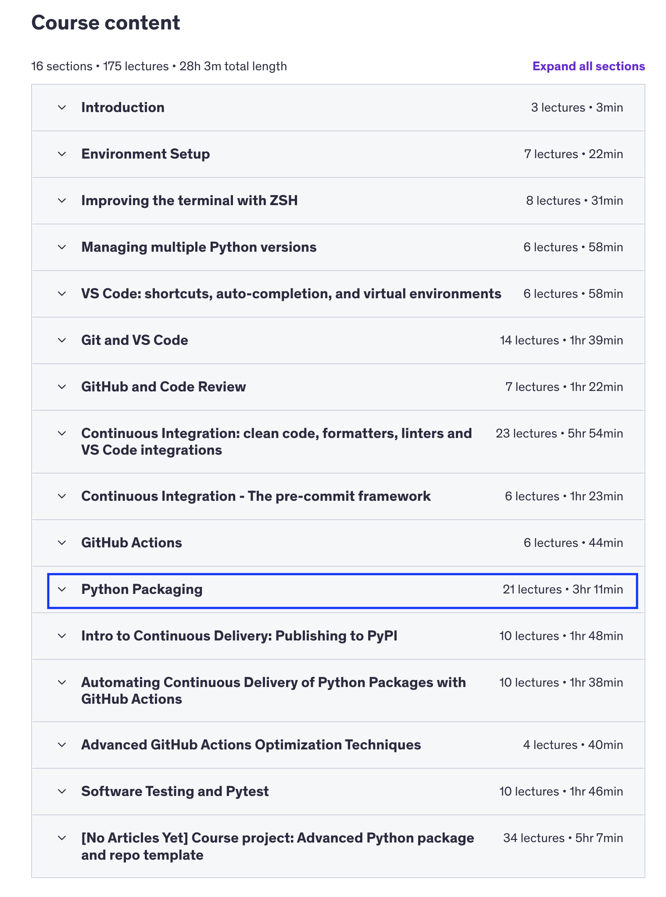

# udemy-tpp-section-11

TPP: Course concerning professional Python integration and usaged.

Section 11: Python Packaging for team and enterprise level work.

Packaging terms: https://docs.python.org/3/glossary.html

- module
- package
- sub-package
- distribution package
git
